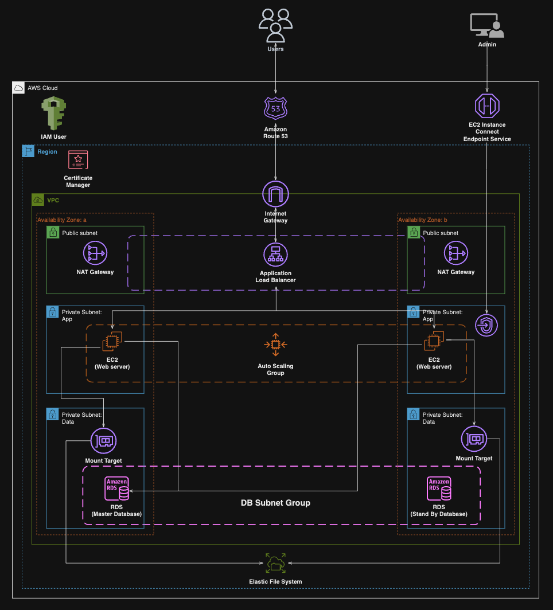

# Host a WordPress Website on AWS

This repository contains the resources and scripts used to deploy a WordPress website on Amazon Web Services (AWS). The project leverages various AWS services to ensure high availability, scalability, and security for the WordPress application.



## Architecture Overview

The WordPress website is hosted on AWS within a robust and scalable architecture incorporating the following components:

1. **Virtual Private Cloud (VPC)**: Configured with public and private subnets spanning across two Availability Zones (AZs) to ensure fault tolerance and high availability.
2. **Internet Gateway**: Deployed to enable connectivity between VPC instances and the wider Internet.
3. **Security Groups**: Implemented as a network firewall mechanism to control inbound and outbound traffic, enhancing security.
4. **Availability Zones**: Utilized two AZs to improve system reliability and fault tolerance.
5. **Public Subnets**: Employed for infrastructure components such as the NAT Gateway and Application Load Balancer, facilitating external access and load balancing.
6. **EC2 Instance Connect Endpoint**: Implemented for secure connections to assets within both public and private subnets.
7. **Private Subnets**: Web servers (EC2 instances) positioned within private subnets for enhanced security.
8. **NAT Gateway**: Enabled instances in private subnets to access the Internet while maintaining security.
9. **EC2 Instances**: Hosted the WordPress website on EC2 instances.
10. **Application Load Balancer (ALB)**: Utilized for evenly distributing web traffic to an Auto Scaling Group of EC2 instances across multiple AZs.
11. **Auto Scaling Group (ASG)**: Automatically manages EC2 instances to ensure website availability, scalability, fault tolerance, and elasticity.
12. **GitHub**: Web files stored on GitHub for version control and collaboration.
13. **Certificate Manager**: Secured application communications using SSL/TLS certificates.
14. **Simple Notification Service (SNS)**: Configured to alert about activities within the Auto Scaling Group.
15. **Route 53**: Registered the domain name and set up DNS records for the WordPress website.
16. **Amazon EFS**: Utilized for shared file system storage.
17. **Amazon RDS**: Employed for hosting the WordPress database.

## Repository Structure

* **Deployment Script**: Contains the script for setting up the web application on the EC2 instance.
* **Architectural Diagram**: Visual respresentation of the AWS architecture.
  
## Deployment Scripts

### Initial Setup Script

This script is used for the initial setup of the web application on an EC2 instance. It includes steps for installing Apache, PHP, and mounting the Amazon EFS to the instance.

```bash
# create to root user
sudo su

# update the software packages on the EC2 instance 
sudo yum update -y

# create an HTML directory 
sudo mkdir -p /var/www/html

# environment variable
EFS_DNS_NAME=fs-064e9505819af10a4.efs.us-east-1.amazonaws.com

# mount the EFS to the HTML directory 
sudo mount -t nfs4 -o nfsvers=4.1,rsize=1048576,wsize=1048576,hard,timeo=600,retrans=2,noresvport "$EFS_DNS_NAME":/ /var/www/html

# install the Apache web server, enable it to start on boot, and then start the server immediately
sudo yum install -y httpd
sudo systemctl enable httpd 
sudo systemctl start httpd

# install php 8 along with several necessary extensions for wordpress to run
sudo dnf install -y \
php \
php-cli \
php-cgi \
php-curl \
php-mbstring \
php-gd \
php-mysqlnd \
php-gettext \
php-json \
php-xml \
php-fpm \
php-intl \
php-zip \
php-bcmath \
php-ctype \
php-fileinfo \
php-openssl \
php-pdo \
php-tokenizer

# install the mysql version 8 community repository
sudo wget https://dev.mysql.com/get/mysql80-community-release-el9-1.noarch.rpm 
#
# install the mysql server
sudo dnf install -y mysql80-community-release-el9-1.noarch.rpm 
sudo rpm --import https://repo.mysql.com/RPM-GPG-KEY-mysql-2023
sudo dnf repolist enabled | grep "mysql.*-community.*"
sudo dnf install -y mysql-community-server 
#
# start and enable the mysql server
sudo systemctl start mysqld
sudo systemctl enable mysqld

# set permissions
sudo chown -R ec2-user:apache /var/www
sudo chmod 2775 /var/www && find /var/www -type d -exec sudo chmod 2775 {} \;
sudo find /var/www -type f -exec sudo chmod 0664 {} \;
chown apache:apache -R /var/www/html

# download wordpress files
wget https://wordpress.org/latest.tar.gz
tar -xzf latest.tar.gz
sudo cp -r wordpress/* /var/www/html/

# create the wp-config.php file
sudo cp /var/www/html/wp-config-sample.php /var/www/html/wp-config.php

# edit the wp-config.php file
sudo vi /var/www/html/wp-config.php

# restart the webserver
sudo service httpd restart
```
### Auto Scaling Group Launch Template Script

This script is included in the launch template for the Auto Scaling Group, ensuring that new instances are configured correctly with the necessary software and settings.

```bash
#!/bin/bash
# update the software packages on the ec2 instance 
sudo yum update -y

# install the apache web server, enable it to start on boot, and then start the server immediately
sudo yum install -y httpd
sudo systemctl enable httpd 
sudo systemctl start httpd

# install php 8 along with several necessary extensions for wordpress to run
sudo dnf install -y \
php \
php-cli \
php-cgi \
php-curl \
php-mbstring \
php-gd \
php-mysqlnd \
php-gettext \
php-json \
php-xml \
php-fpm \
php-intl \
php-zip \
php-bcmath \
php-ctype \
php-fileinfo \
php-openssl \
php-pdo \
php-tokenizer

# install the mysql version 8 community repository
sudo wget https://dev.mysql.com/get/mysql80-community-release-el9-1.noarch.rpm 
#
# install the mysql server
sudo dnf install -y mysql80-community-release-el9-1.noarch.rpm 
sudo rpm --import https://repo.mysql.com/RPM-GPG-KEY-mysql-2023
sudo dnf repolist enabled | grep "mysql.*-community.*"
sudo dnf install -y mysql-community-server 
#
# start and enable the mysql server
sudo systemctl start mysqld
sudo systemctl enable mysqld

# environment variable
EFS_DNS_NAME=fs-02d3268559aa2a318.efs.us-east-1.amazonaws.com

# mount the efs to the html directory 
echo "$EFS_DNS_NAME:/ /var/www/html nfs4 nfsvers=4.1,rsize=1048576,wsize=1048576,hard,timeo=600,retrans=2 0 0" >> /etc/fstab
mount -a

# set permissions
chown apache:apache -R /var/www/html

# restart the webserver
sudo service httpd restart
```

## How to Use

1. Clone this repository to your local machine.
2. Follow the AWS documentation to create the required resources (VPC, subnets, Internet Gateway, etc.) as outlined in the architecture overview.
3. Use the provided scripts to set up the static HTML web app on EC2 instances within the VPC.
4. Configure the Auto Scaling Group, Load Balancer, and other services as per the architecture.
5. Access the web app through the Load Balancer's DNS name.

## Additional Resources
* AWS Documentation
* Git-Hub Repository for Web files:

This project is licensed under the MIT License - see the LICENSE file for details.
